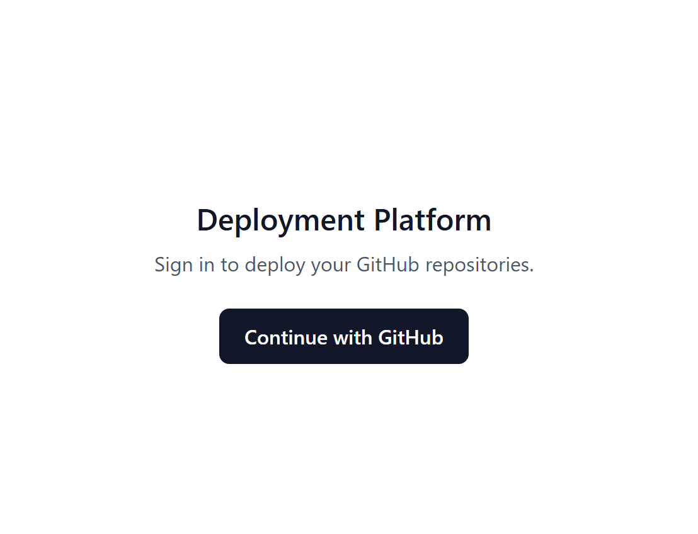
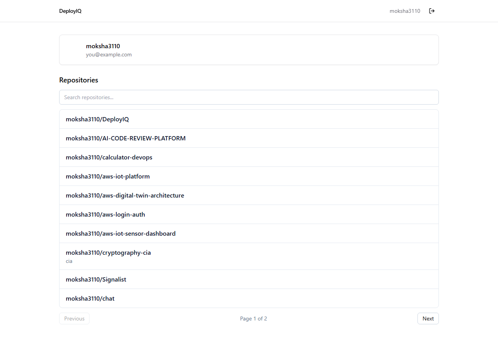
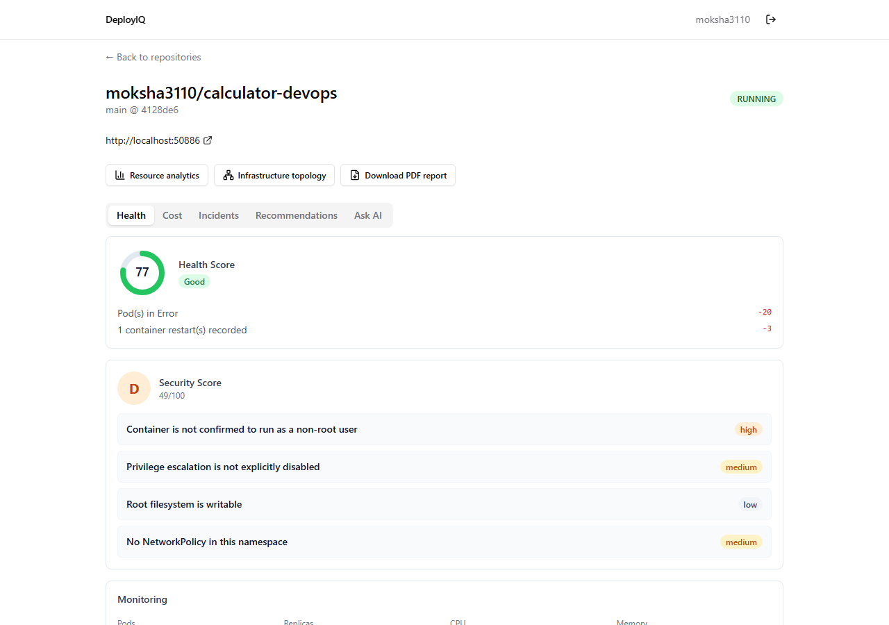
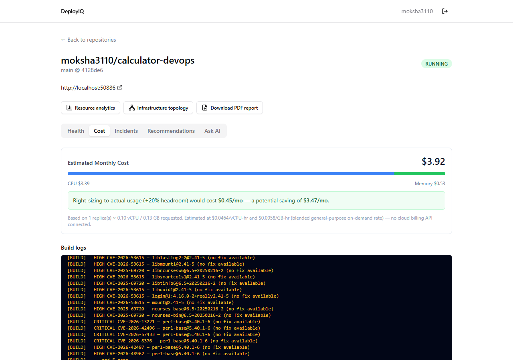
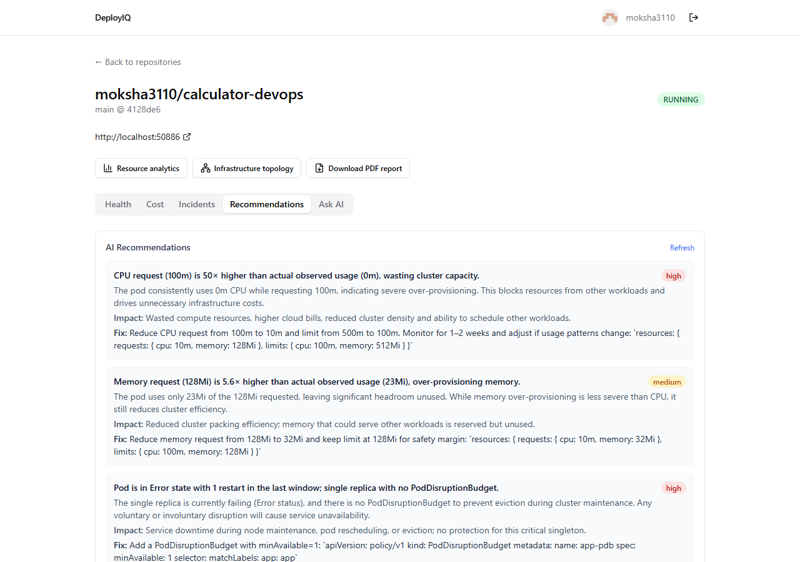
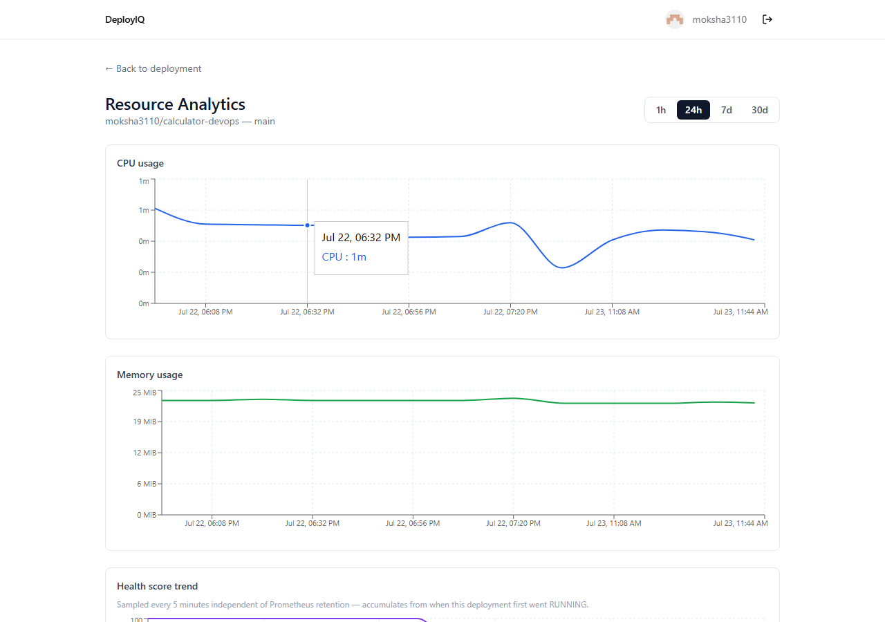
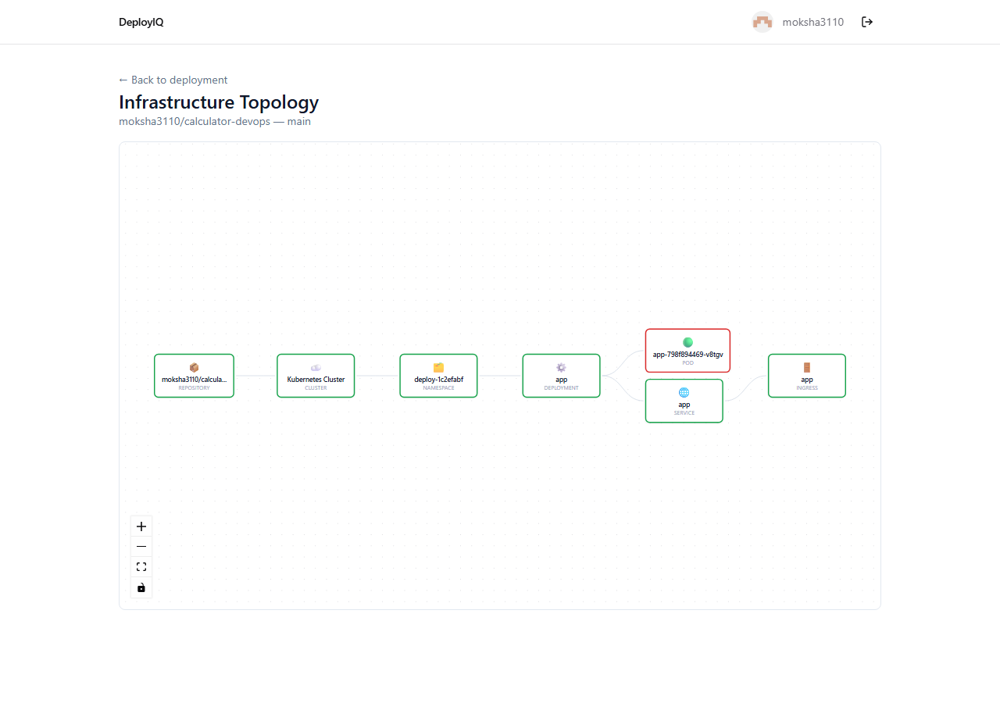
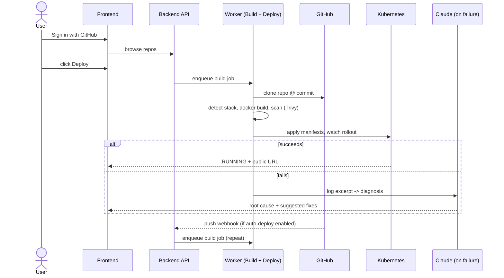

# DeployIQ — AI-Powered Kubernetes Deployment Platform

A self-hosted deployment platform (Render/Railway/Heroku-style) built from
scratch: GitHub OAuth login, one-click deploy of any repo onto a real
Kubernetes cluster, live build/deploy logs, automatic redeploy on push, and
an AI Infra Intelligence layer that goes well past "is it up" — a live
0-100 health score, an A-F security scan, AI-generated cost/reliability
recommendations, automatic incident detection, an interactive infra
topology graph, natural-language Q&A over live cluster state, and
downloadable PDF reports.

Built as a portfolio project to demonstrate distributed systems, container
orchestration, and applied AI engineering — see
[`docs/ARCHITECTURE.md`](docs/ARCHITECTURE.md) for the full design
rationale, including _why_ each technology was chosen, not just that it
was used.

## Screenshots

<table>
<tr valign="top">
<td align="center">

**Sign in with GitHub**<br/>


</td>
<td align="center">

**Repositories**<br/>


</td>
</tr>
<tr valign="top">
<td align="center">

**Live health + security scoring**<br/>


</td>
<td align="center">

**Cost estimate + real build logs**<br/>


</td>
</tr>
<tr valign="top">
<td align="center">

**AI-generated recommendations**<br/>


</td>
<td align="center">

**Resource analytics (Recharts)**<br/>


</td>
</tr>
</table>

**Interactive infrastructure topology (React Flow)**


Every screenshot above is a real running deployment on a local Minikube
cluster — nothing mocked. The Trivy CVE scan and CPU/memory numbers are
genuine output from a real `docker build` and real Prometheus queries.

## Status

All 21 milestones complete (M0-M10 core platform, M11.1-M11.10 AI Infra
Intelligence) — see [`docs/MILESTONES.md`](docs/MILESTONES.md) for the
build order, and what changed from the original plan along the way (and
why: every deviation is a decision, not a shortcut).

Every milestone in this repo was verified against real infrastructure while
being built — a real GitHub account, a real Minikube cluster, a real Docker
daemon, a real Prometheus/Loki/Grafana stack, real calls to the Claude API
— not just typechecked and assumed to work. Where that verification found a
real bug (there were several — an unhandled Redis error crashing the
backend, a webhook handler crashing on unauthenticated malformed input, an
authorization gap, a broken third-party logging library, a CI formatting
check that silently regressed for four milestones), it's called out
explicitly in the relevant doc rather than smoothed over.

## How it works



Once a deployment is `RUNNING`, the AI Infra Intelligence layer takes over:
a health score, security scan, and cost estimate compute on-demand from
live cluster + Prometheus state; a background job snapshots health and
scans for incidents every 5 minutes independent of whether anyone has the
dashboard open; and the "Ask AI" panel runs an agentic Claude tool-use loop
over that same live state to answer free-form questions.

The full component breakdown, sequence diagrams, and the reasoning behind
each piece live in [`docs/ARCHITECTURE.md`](docs/ARCHITECTURE.md).

## Docs

- [Architecture](docs/ARCHITECTURE.md) — components, tech choices, diagrams, data flow
- [API design](docs/API.md) — REST endpoints
- [Kubernetes design](docs/KUBERNETES.md) — generated manifests, namespacing, rollout verification
- [Security posture](docs/SECURITY.md) — secrets, auth, injection, rate limiting, scanning, explicit gaps
- [Milestones](docs/MILESTONES.md) — build order, current status, and what changed from the original plan

## Structure

```
apps/
  frontend/      React + TS + Tailwind + shadcn/ui SPA, Vitest unit tests, Playwright e2e (apps/frontend/e2e/)
  backend/       Express + TS API server, BullMQ worker, Prisma schema, Vitest unit tests
packages/
  shared-types/  DTOs shared between frontend and backend
infra/
  docker/        docker-compose for local Postgres + Redis
  prometheus/    kube-prometheus-stack Helm values (Prometheus + Grafana)
  loki/          loki-stack Helm values (Loki + Promtail)
docs/            Architecture, API, Kubernetes, security, and milestone docs
```

## Local development

Requires Node 22+ and Docker Desktop.

```bash
npm install

# Postgres + Redis
docker compose -f infra/docker/docker-compose.yml up -d

# Copy env files and fill in secrets (see comments in each .env.example
# for where to get them — GitHub OAuth App, Anthropic API key, etc.)
cp apps/backend/.env.example apps/backend/.env
cp apps/frontend/.env.example apps/frontend/.env

# Apply the schema
npm run prisma:migrate --workspace apps/backend

# Terminal 1 — API server
npm run dev:backend
# Terminal 2 — build/deploy worker
npm run dev:worker --workspace apps/backend
# Terminal 3 — frontend
npm run dev:frontend
```

Backend on `http://localhost:4000`, frontend on `http://localhost:5173`.
Sign in with GitHub, browse your repos, click Deploy.

`npm run lint` / `npm run typecheck` / `npm run build` / `npm run test` run
across all workspaces and are what CI checks on every push.

### Testing

```bash
# Unit tests (Vitest, both workspaces)
npm run test

# End-to-end (Playwright, mocked API — no backend needed)
npx playwright install chromium   # once
npm run test:e2e --workspace apps/frontend
```

Both are required CI jobs. See [docs/MILESTONES.md](docs/MILESTONES.md#m9)
for why e2e mocks the API instead of exercising real GitHub OAuth.

### Deploying to Kubernetes

Requires Minikube and `kubectl`.

```bash
minikube start --driver=docker
```

The backend then talks to whatever cluster your kubeconfig points at — no
separate config needed, same code path as a real cluster. Deploys land in
their own namespace and get a real local URL via a managed
`kubectl port-forward` — see [docs/KUBERNETES.md](docs/KUBERNETES.md) for
why (short version: Minikube's Docker driver doesn't expose NodePorts the
way a real cluster or a Linux VM driver does, confirmed against a real
cluster rather than assumed).

### Monitoring stack (Prometheus, Grafana, Loki)

Requires Helm.

```bash
helm repo add prometheus-community https://prometheus-community.github.io/helm-charts
helm repo add grafana https://grafana.github.io/helm-charts

helm install kube-prometheus-stack prometheus-community/kube-prometheus-stack \
  --namespace monitoring --create-namespace \
  -f infra/prometheus/values.yaml --wait

helm install loki grafana/loki-stack \
  --namespace monitoring \
  -f infra/loki/values.yaml --wait
```

The backend reaches Prometheus and Loki via its own managed
`kubectl port-forward`s — nothing else to configure. Set `LOKI_ENABLED=true`
in `apps/backend/.env` to ship the platform's own structured logs there
too (off by default; logs always go to the console either way). To view
Grafana yourself:

```bash
kubectl port-forward -n monitoring svc/kube-prometheus-stack-grafana 3000:80
# admin / $(kubectl get secret -n monitoring kube-prometheus-stack-grafana \
#   -o jsonpath="{.data.admin-password}" | base64 -d)
```
