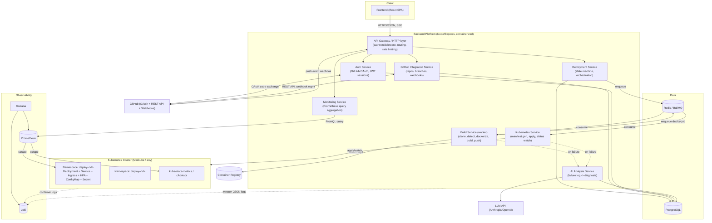
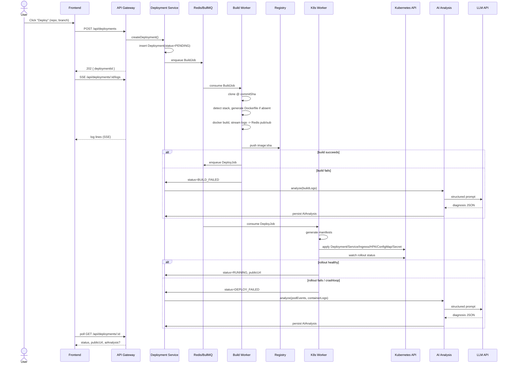
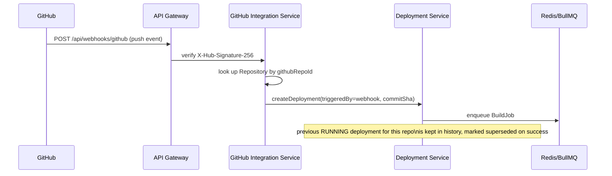

# Architecture

## 1. What this project is

A self-hosted, AI-assisted PaaS: a user connects GitHub, picks a repo, and the
platform builds a container image, generates Kubernetes manifests, deploys to
a cluster, exposes a public URL, watches health/metrics, and — when a
deployment fails — asks an LLM to diagnose why.

The interesting engineering is not the CRUD (repos, deployments). It's the
**orchestration of untrusted, heterogeneous, long-running work** (arbitrary
git repos, of arbitrary language/framework, built into containers, deployed
onto shared infrastructure) with **observability and self-healing feedback**
layered on top. That's the story for interviews and for MSCS applications:
distributed systems, queuing, container orchestration, and applied AI, not
another to-do app.

## 2. Why each technology

| Choice                                                 | Reason it's here, not an alternative                                                                                                                                                                                                                                                         |
| ------------------------------------------------------ | -------------------------------------------------------------------------------------------------------------------------------------------------------------------------------------------------------------------------------------------------------------------------------------------- |
| **React + TS + Tailwind + React Query + React Router** | React Query specifically: deployments are long-running async state (PENDING → BUILDING → DEPLOYING → RUNNING) that must be polled/streamed and cached with invalidation — this is exactly React Query's design target, not just "team knows React."                                          |
| **Node/Express + TS backend**                          | The backend is I/O-orchestration heavy (GitHub API, Docker daemon/BuildKit, Kubernetes API, Redis, Postgres) not CPU-heavy. Node's async I/O model fits; TS gives us contract safety across a system with many moving external APIs.                                                         |
| **GitHub OAuth**                                       | Avoids reinventing password auth (out of scope, and a security liability) while giving us exactly the scope we need: repo listing + webhook registration. Demonstrates OAuth2 authorization-code flow correctly, which is a common interview topic.                                          |
| **PostgreSQL + Prisma**                                | Deployments, users, repos, and AI analyses are relational with real foreign keys and need transactional consistency (e.g., "create deployment row + enqueue job" must not partially fail). Prisma gives migrations + type-safe queries, which matters once the schema has 6+ related tables. |
| **Docker**                                             | Universal build/runtime unit; lets us support "any repo" instead of one language.                                                                                                                                                                                                            |
| **Docker Hub (configurable)**                          | Free tier is enough for a portfolio project; the registry client is abstracted behind an interface (`ImageRegistry`) so swapping to ECR/GCR later is a config change, not a rewrite — worth calling out in interviews as an example of the Strategy pattern applied to infra.                |
| **Kubernetes + Minikube**                              | The core subject of the project. Minikube gives a real API server locally — the deployment engine talks to the Kubernetes API the same way it would talk to EKS/GKE.                                                                                                                         |
| **Redis + BullMQ**                                     | Builds take seconds to minutes and must not block the HTTP request thread or die if the API process restarts. BullMQ gives durable, retryable, observable job queues — this is the same pattern real CI/CD systems (GitHub Actions runners, CircleCI) use internally.                        |
| **Prometheus + Grafana**                               | Standard cloud-native metrics stack; Kubernetes ships `kube-state-metrics`/cAdvisor data in a shape Prometheus expects natively — reimplementing this would be pure yak-shaving.                                                                                                             |
| **Loki + Winston**                                     | Structured app logs (Winston, JSON) shipped to Loki so logs and metrics live in the same Grafana pane — mirrors how logging is actually done in industry (correlate a metric spike with a log line).                                                                                         |
| **GitHub Webhooks (+ Actions optional)**               | Push-based redeploy is event-driven architecture, not polling — worth defending in an interview over "poll GitHub every N seconds."                                                                                                                                                          |
| **Anthropic/OpenAI API for failure analysis**          | The differentiator feature: turn raw pod events + container logs into a structured diagnosis (root cause, fix suggestions, confidence). This is applied LLM engineering (structured output, prompt design, confidence calibration), not a chatbot bolted on.                                 |
| **Jest + Playwright**                                  | Unit/integration coverage on services (build detection, manifest generation, AI response parsing) via Jest; Playwright for the one path that actually matters end-to-end — login → deploy → see RUNNING.                                                                                     |

## 3. System components

### Component responsibilities

- **API Gateway** — the only component the frontend talks to. Auth middleware, request validation (zod), routing to services, SSE endpoints for live log streaming.
- **Auth Service** — GitHub OAuth authorization-code flow, issues short-lived JWT + refresh via httpOnly cookie, encrypts and stores the GitHub access token (needed later for repo/webhook calls).
- **GitHub Integration Service** — lists repos/branches via the GitHub REST API using the user's token, registers/verifies webhooks, receives and validates (`X-Hub-Signature-256`) push events.
- **Deployment Service** — the state machine owner. Creates `Deployment` rows, transitions status, enqueues build jobs, exposes deployment history/rollback.
- **Build Service (worker)** — separate process (own container) consuming BullMQ jobs: shallow clone at a commit SHA into an ephemeral workspace, detect project type, generate a `Dockerfile` if absent, `docker build`, tag with the commit SHA, push to the registry. Streams log lines to a Redis pub/sub channel the Gateway relays over SSE.
- **Kubernetes Service** — wraps `@kubernetes/client-node`. Pure functions turn a `Deployment` + `Repository` config into manifest objects (Deployment/Service/Ingress/HPA/ConfigMap/Secret), applies them idempotently, watches rollout status.
- **AI Analysis Service** — triggered on `BUILD_FAILED`/`DEPLOY_FAILED`. Collects build logs + k8s events/container logs, sends a structured prompt to the LLM, parses a typed JSON response (`rootCause`, `suggestedFixes[]`, `confidence`), persists it.
- **Monitoring Service** — runs PromQL queries against Prometheus (CPU/mem/restarts/pod count per deployment) and exposes them as plain REST for the frontend to poll; also serves historical range queries for charts.

### Why a worker process, not inline in the API

`docker build` and `kubectl apply`/rollout-wait can take seconds to minutes.
Running them inside an Express request handler would tie up the HTTP
connection and make the API unavailable under load. Splitting Build/K8s work
into BullMQ-consumed workers means: the API responds instantly ("deployment
queued"), failures are retryable with backoff, and we can scale build
capacity independently of API capacity — a real distinction interviewers
probe for.

## 4. Deployment workflow (sequence)

### Auto-redeploy

## 5. Why per-deployment namespaces

Each deployment gets its own Kubernetes namespace (`deploy-<deploymentId-short>`).
This gives free isolation (NetworkPolicy scoping, resource quotas, RBAC) and
a trivial teardown path (`kubectl delete namespace`) without hand-tracking
every object we created. The tradeoff — namespace sprawl — is acceptable
here because deployments are ephemeral and lifecycle-managed by us, and it's
worth stating that tradeoff explicitly if asked in an interview.

## 6. Local dev vs. target cluster

Platform services (frontend, backend API, build worker, Postgres, Redis,
Prometheus, Grafana, Loki) run via `docker-compose` for local development —
fast iteration, no need to containerize the platform itself yet. The
**target** the platform deploys _user_ applications onto is a real
Kubernetes API (Minikube locally; any conformant cluster in principle) reached
via kubeconfig. Milestone 8+ adds an optional Helm chart to run the platform
itself on Kubernetes (dogfooding), but that is explicitly a stretch goal, not
a dependency for the core feature set.
